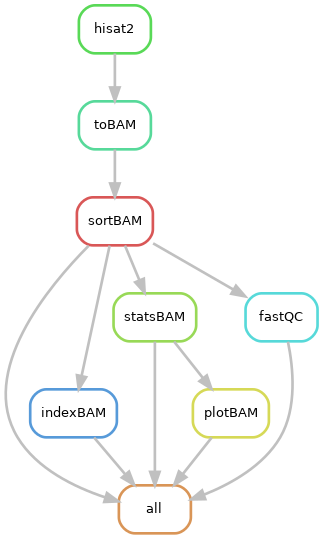

# snakemake-bulkrna-seq
A snakemake workflow for bulk RNA-seq data preprocessing including sequence alignment, quality check etc.
================
Zhengqiao Zhao, Yuri Pritykin

October, 2022

Installation
------------
1. The core environment can be installed using `conda`. The pipeline relies on [hisat2](http://daehwankimlab.github.io/hisat2/), [samtools](http://www.htslib.org/doc/samtools.html) and [fastqc](https://www.bioinformatics.babraham.ac.uk/projects/fastqc/).
```bash
conda create -n snakemake_bulkRNA -c bioconda -c conda-forge snakemake hisat2 samtools fastqc gnuplot
```
2. We also provide an R environment for gene count matrix build and differential gene expression analysis using [Rsubread](https://subread.sourceforge.net/featureCounts.html) and [DESeq2](https://bioconductor.org/packages/devel/bioc/vignettes/Glimma/inst/doc/DESeq2.html).
```bash
conda create -n r_deseq -c bioconda -c conda-forge -c r r-tidyverse r-data.table bioconductor-deseq2 bioconductor-rtracklayer bioconductor-summarizedexperiment bioconductor-rsubread r-pheatmap
```
Running the pipeline
---------------------------
### Data Requirements
The raw fastq files should be placed in one directory, e.g., `raw_data`. The name of the fastq files should follow this pattern: `<sample_name>_R<1,2>.fastq`. For example, `raw_data` should have the following directory structure:
```
raw_data
|   SAMPLE1_R1.fastq
|   SAMPLE1_R2.fastq
|   SAMPLE2_R1.fastq
|   SAMPLE2_R2.fastq
|   ...
```
The config file should have the exact sample names (excluding `_R<1,2>.fastq` suffix) and Snakemake file should have the absolute path to the raw data directory and the results directory that used to save the pipeline outputs including the alignment results.
### Run the pipeline
1. modify the `cluster.json` file so that it is compatible with your computation cluster settings.
2. run the following command in terminal:
```
bash run_snakemake.sh
```
DAG of this snakemake workflow
---------------------------
The following image shows the directed acyclic graph (DAG) of jobs where the edges represent dependencies.        
        
It can be obtained by running the following command in the snakemake conda environment:
```bash
snakemake --forceall --rulegraph | dot -Tpng > RULE_DAG.png
```
